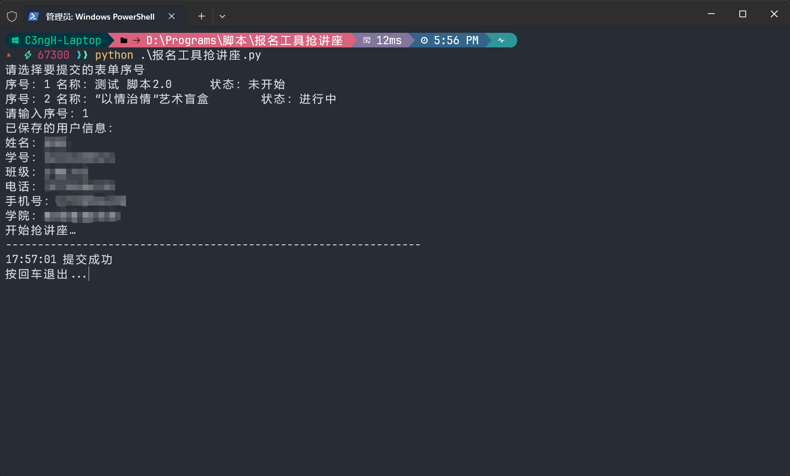
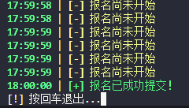
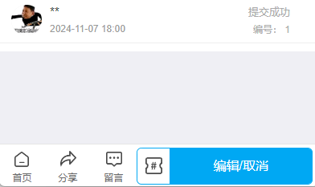

# 微信小程序-报名工具自动提交脚本
微信小程序-报名工具自动提交脚本，适用于抢志愿者、讲座、报名大型活动等，24年12月仍可用

### 安装依赖

```
pip install -r requirements.txt
```

### 使用方法

#### 二维码登录版

1. 运行程序后手机扫描弹出的二维码，会自动登录
2. 其余步骤和下面的一样

#### 账号密码登录版

1. 在这个网站使用微信登录后设置密码（重置密码） https://baominggongju.com/

2. 设置快速填写信息

   

3. 在手机上先扫码进入要报名的活动，确保已经进入过一次，留下历史记录

5. 运行脚本

注：可搜索`time.sleep()`修改发包间隔时间

### 测试效果

#### 二维码登录版


#### 账号密码登录版







### 更新日志

- 24.10.8
  - 新增随机UA头功能
  - 优化代码可读性
  
- 24.10.9
  - 优化输出和交互部分，统一格式
  - 新增抢讲座失败20次自动结束脚本
  
- 24.10.22
  - 修改功能：输入密码时不显示输入内容
  - 输入账号和密码后如果登录成功则会刷新终端，账户和密码信息不会停留在屏幕上
  - 进一步统一交互部分格式，统一采用`[!] [-] [+]`
  - 紧急修复：修复连续发包100词左右会因为SSL问题采用连接报错退出问题，采用Session0复用，目前脚本可以稳定运行10mins+
  
- 24.11.4
  * 使用rich美化
  * 增加刷新程序记录的功能，不用重新运行脚本
  * 增加多线程功能，能同时抢多个活动。
  
- 24.11.7
  - 优化逻辑，任务列表为空时也支持刷新
  - 合并文件，精简代码
  - 使用`fake_useragent`模块随机UA头
  - 新增密码输入错误重输功能
  
- 24.11.7 v2.3.1
  - 修复活动状态错误问题，例如进行中的活动依然显示未开始
  - 修复二进制文件报错问题
  
- 24.11.11

  - 修复`[!] 登录失败，账号风险2，不允许通过账号密码登录，请微信扫码或授权登录。`

    原因：随机UA头太多，报名工具不检测单UA头多次发包，检测登录的UA头数量，登录设备过多会导致账号风险

    解决方案：回退到固定UA头，同时在注释内保留随机UA头功能，用户可自行选择
    
    如需使用随机UA头功能，去除第10、24-27、48、147行注释，并注释掉第49、148行注释即可
    
    **如果已经存在风险，则可以先使用浏览器扫码登录报名工具官网，然后在token有效期内使用账号密码登录本程序即可正常使用，只是每次抢讲座都需要重新扫码登录一次**
  
- 24.12.02

  - 修复 `[!] 登录失败，从2024/12/01起，仅支持VIP用户通过手机号密码快速登录`

    采用微信扫描二维码登录，经4个测试版本后已经稳定


### 期望功能

目前功能上已经几乎不存在问题，可以稳定使用，接下来的功能**可能**会在空余的时间实现

- 集成到平台，可以使用在线网站进行交互（可不可以当毕设呢？

- 实现模糊匹配需要填充的信息
- 未添加数据的自动填充，例如表单需要填写手机号，但已有信息内没有手机号，则自动识别类型并默认输入一个符合要求且随机生成的手机号

**可能会在期末考结束后重构整个代码，更加模块化**

### 打赏相关

我承诺会一直开源，并在空闲时间内维护。

如果觉得脚本方便有效的话可以请我喝一杯咖啡，你的支持是最大的动力。

<center class="half">


</center>

#### 特别鸣谢：

| 赞助者                                                 | 留言                           | 金额  |
| ------------------------------------------------------ | ------------------------------ | ----- |
| [@minjiezhuzhuxia](https://github.com/minjiezhuzhuxia) | 感谢无私分享，劳动成果需要认可 | 30.00 |

